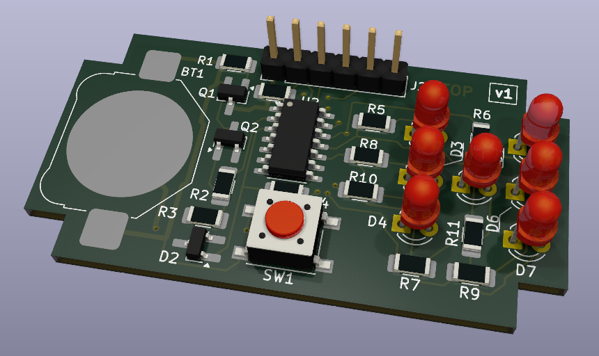
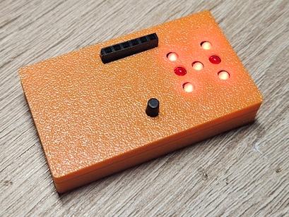

# Electronic dice - SMD
This is the construction of electronic dice with SMD components. It is based on ATTINY24A microcontroller.

PCB is 2-layer and was designed using KiCad 9. Fabrication output for JLCPCB is in gerber folder.

Happy soldering!

